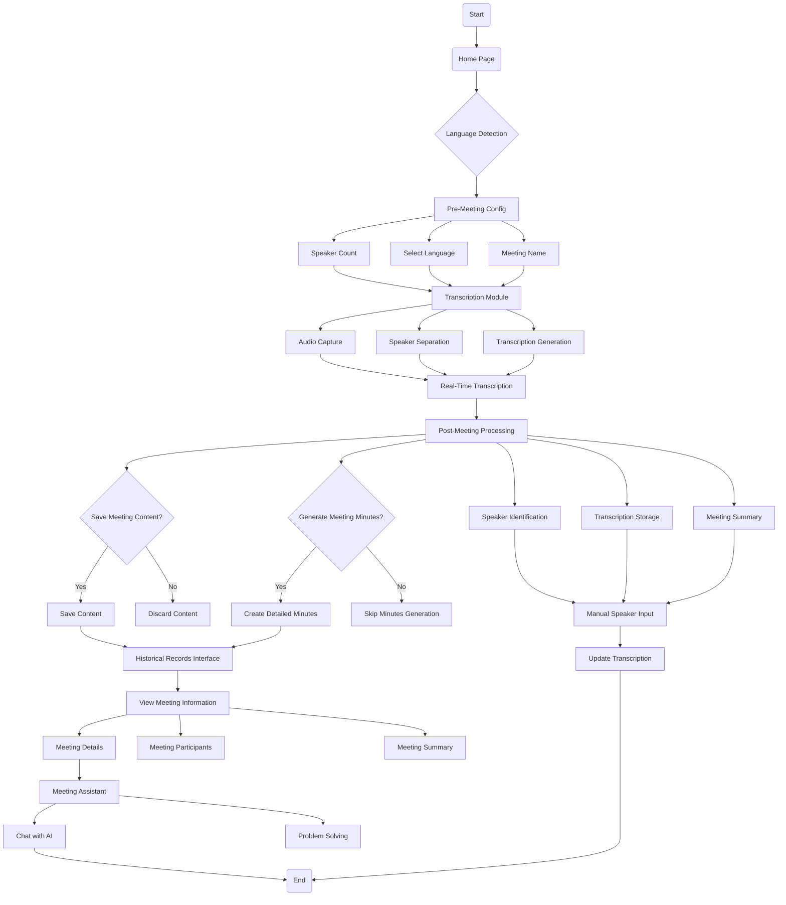

# VoiceLink Intelligent Meeting Assistant

+ **Group Member**

| 2253744 Juekai Lin (100%) | 2251653 Tong Li (100%) | 2251548 Jingxiao Han (100%) |
| ------------------------- | ---------------------- | --------------------------- |

+ **Instructor: Ying Shen**

[TOC]

## 1. Project Description

The primary challenge addressed by this project is creating an efficient, user-friendly solution for real-time meeting transcription with speaker separation. Traditional meeting recording methods often struggle with several key issues:

+ **Accuracy in Speaker Identification**

Distinguishing between different speakers in a multi-participant conversation is a complex task, especially in noisy or overlapping speech scenarios. The presence of background noise or simultaneous talking makes it difficult to accurately identify each speaker, requiring advanced algorithms to separate voices and maintain clarity.

+ **Real-Time Processing** 

Providing instantaneous transcription during live meetings requires sophisticated speech recognition and processing capabilities.  The system must not only recognize and transcribe speech in real time but also handle multiple speakers, background noise, and overlapping dialogues, ensuring high accuracy even in dynamic and noisy environments.

+ **Contextual Preservation**

Maintaining the context and flow of conversation while accurately attributing speech to specific participants is challenging.  The system must distinguish between speakers, track turns, and ensure coherence, even in overlapping speech, to accurately reflect the conversation's structure and meaning.

+ **Accessibility and Usability**

Developing an intuitive and user-friendly interface that allows easy configuration, recording, and post-meeting analysis across different devices and meeting environments involves creating a user-friendly design. It should enable seamless setup, real-time interaction, and provide easy access to recorded data and insights, ensuring compatibility with various platforms.

Our solution aims to create a comprehensive meeting transcription system that overcomes these challenges by leveraging advanced speech recognition technologies and intelligent speaker separation algorithms. This system will accurately transcribe speech in real-time, effectively handle overlapping dialogues, and differentiate between multiple speakers, ensuring clear and precise meeting records.

## 2. Theme and Related Methods & Technologies

### 2.1. Project Theme

The project "VoiceLink Smart Meeting" is designed to streamline and enhance meeting management through advanced speech recognition and AI-powered features. The platform consists of four key pages:

1. **Homepage**: Users can interact with the system via voice commands to navigate to various functions.
2. **Smart Meeting Recording**: This page allows users to record meetings, set parameters such as language and participant count, capture real-time dialogue, separate speakers, and generate meeting summaries.
3. **Meeting Assistant**: A smart chatbot is available to answer queries and assist with meeting-related tasks.
4. **History Records**: Users can view past meeting details, including start and end times, participants, and summaries.

This comprehensive system aims to provide a seamless, efficient solution for managing meetings from start to finish, improving productivity and communication.

### 2.2. Related Methods & Technologies

#### 2.2.1. Speech Recognition and Speaker Diarization Technologies

+ **Web Speech API**
  - Pros: Browser-native, lightweight, easy to implement.
  - Cons: Limited accuracy, language support, and offline capabilities.
+ **OpenAI Whisper**
  - Pros: 
    - Multilingual support.
    - High accuracy across various accents.
    - Open-source model.
  - Cons: 
    - Computational intensity.
    - Requires significant processing resources.
+ **Pyannote-Audio**
  - Pros:
    - Specialized in speaker diarization.
    - Advanced machine learning techniques.
    - Supports complex speaker separation scenarios.
  - Cons:
    - Steeper learning curve
    - Requires more sophisticated setup

#### 2.2.2. Communication Protocols

+ **WebSocket (WSS)**
  + Enables real-time, bidirectional communication.
  + Low latency.
  + Supports continuous data streaming
+ **REST API**
  + More traditional communication method.
  + Less suitable for real-time applications.

#### 2.2.3. Robot Chat Technology

+ **Large language models (LLM, such as GPT and Tongyi)**
  + Pros:
    + Strong performance: Generate smooth dialogue, adapt to multiple rounds of interaction.
    + No need for extensive customization: the common model already covers a wide range of knowledge and language capabilities.
  + Cons:
    + High cost: The model is expensive to invoke and run.
    + Low model transparency: The process of generating content may not be easy to explain, affecting trust.

#### 2.2.4. The Technologies Our Project Choose

+ **Real-time recording**

By invoking the real-time translation API of Tongyi Qianwen, our project realized real-time recording of meeting content, ensuring that users can obtain accurate meeting information in time and improve meeting efficiency.

+ **Speaker identification**

Using the polling detection API of Tongyi, we realized the automatic recognition function of the speaker, accurately distinguished each speaker in the meeting and recorded the corresponding content, improving the accuracy of the meeting minutes.

+ **Intelligent robots**

Adopt the intelligent chatbot API of Tongyi Qianask to provide support for the meeting question assistant, so that users can ask questions in real time and get intelligent answers, improving the convenience of meeting interaction.

+ **Data storage**

Meeting records are stored in CSV file format, which ensures data persistence and security, and facilitates users to view and manage historical meeting records at any time.

+ **Technical framework**

The front and back end of the project is developed based on Flask framework, the front-end uses HTML, the back-end uses Python language, to ensure the development efficiency of the system and cross-platform adaptation ability.

## 3. Project Structure and Workflow

### 3.1. Project Files Structure

This is the project structure of our VoiceLink Intelligent Meeting Assistant:

```markdown
VoiceLink Intelligent Meeting Assistant
    │
    ├── assets
    ├── app   
    |	├── data
    |	|	└── meetingInfo.csv
    |	├── static
    |	|	├── background.jpg
    |	|	└── ......
    |	├── templates
    |	|	├── home.htnl
    |	|	├── meetingAssistant.html
    |	|	├── meetingHistory.html
    |	|	└── meetingNote.html
    |	├── __init__.py
    |	├── backendRoutes.py
    |	├── meetingInfo.py
    |	├── routes.py
    |	└── voiceRoutes.md
    ├── run.py
    ├── requirements.txt
    ├── README.md
    ├── README.pdf
    ├── REPORT.md
    └── REPORT.pdf
```

+ **run.py**: The entry file for launching the application.
+ **data** folder: It contains records of past meetings.
+ **static** folder: It contains some static image styles.
+ **templates** folder: This is where the html code for all front-end pages is stored.
+ **python files** in the **app** folder: Back-end routing and interface code files.
+ **requirements.txt**: Python packages that the project depends on.
+ **README.md/README.pdf**: The readme file with instructions on how to run the program.
+ **REPORT.md/REPORT.pdf**: Project presentation report in English.

### 3.2. Project Architecture Structure

Our system structure diagram is mainly used to show how the different components of the system are organized and work together:

```markdown
[User Interface] 
    │
    ├── Pre-Meeting Configuration
    │   ├── Speaker Count
    │   ├── Language Selection
    │   └── Meeting Name
    │
    ├── Real-Time Transcription Module
    │   ├── Audio Capture
    │   ├── Speaker Separation
    │   └── Transcription Generation
    │
    ├── Post-Meeting Processing
    │   ├── Speaker Identification
    │   ├── Transcription Storage
    │   └── Meeting Summary Generation
    │
    ├── Historical Records Interface
    │   └── View Past Meetings
    │
    └── Meeting Question Assistant
        ├── Chat with AI
        ├── Problem-Solving Assistance
        └── Answer Query
```

The system first allows users to set meeting parameters, including the number of speakers, language selection, and meeting name. During the meeting, the real-time transcription module enables the system to automatically identify and transcribe the speech content, and distinguish the speech of different participants using speaker separation technology. At the same time, the system will process the transcript in a polling process, identify the identities of each speaker and generate a summary of the meeting for easy archiving and review. In addition, users can also view past meeting minutes through the history interface, and the Meeting Question Assistant module provides intelligent robot services to answer questions raised by users during the meeting process, further improving the meeting experience and efficiency.

### 3.3. Project Workflow

The workflow of our project is roughly shown in the figure below:



The workflow of our project starts with language detection, enabling real-time transcription and speech separation by configuring meeting parameters and audio capture. After a meeting, the system provides options to save meeting content and generate meeting minutes. You can also view meeting details on the history page, providing convenient meeting management and review experience.

## 4. Project Functionality and Implementation

### 4.1. The Home Page

The home page of the project is the default page, which contains the main title of our project and the two main function points. We can click the button of each interface to realize the page jump, or through voice input, the background through the recognized information to select the page jump.The home page at the time of recording is roughly as follows:


+ The "Voice input" button on the page triggers the speech recognition function. 
+ After clicking this button, the page starts recording. The SpeechRecognition API provided by the browser was used for speech recognition, and the language was set to Chinese (zh-CN). 
+ When the user starts speaking, the browser converts the user's voice into text (transcript) and displays it on the page in real time.
+ After the user's voice is recognized, the program will determine whether the recognition result contains specific keywords, such as "real-time record", "problem assistant", and "history meeting".

The front-end interface determines the code of the jump interface by the identified voice results:

```javascript
recognition.onresult = function (event) {
                const transcript = event.results[event.resultIndex][0].transcript;
                console.log('识别结果: ', transcript);
                document.getElementById('recordingStatus').style.display = 'none'; 

                if (transcript.includes('实时记录') || transcript.includes('记录') || transcript.includes('实时')) {
                    document.getElementById('transcript').innerText = '即将前往智能会议记录...';
                    setTimeout(() => location.href = '/meetingNote', 2000);
                } else if (transcript.includes('问题') || transcript.includes('聊天') || transcript.includes('助手') || transcript.includes('智能')) {
                    document.getElementById('transcript').innerText = '即将前往会议问题助手...';
                    setTimeout(() => location.href = '/meetingAssistant', 2000);
                } else if (transcript.includes('历史会议') || transcript.includes('历史') || transcript.includes('查看')) {
                    document.getElementById('transcript').innerText = '即将前往查看历史记录...';
                    setTimeout(() => location.href = '/meetingHistory', 2000);
                }
            };
```

Then, you will see a prompt to redirect to the page:


Above is the function point display of the home page and the general implementation code display.

### 4.2. The MeetingNote Page

In the intelligent meeting minutes interface, you need to set the number of participants and the name of the meeting before starting the meeting minutes:


Click the confirmation button, we set some basic parameters of the meeting, now click to start the meeting, you can start the record of the meeting content. The records are returned, and you can see the results on the screen:


When the user requests access to the / <task_id> / record interface through the GET, the system receives the meeting task ID and starts generating the meeting minutes. First, the code prints out the current task ID and marks the task as active. Then, the poll_meeting function is called to poll the meeting status until the final result of the meeting is obtained. If the transliteration result is obtained successfully obtained, the system extracts the URL of the transliteration result and returns it to the user; if an error occurs during the acquisition, the system will capture the exception and return the corresponding error.

```python
@meeting_bp.route('/<task_id>/record', methods=['GET'])
def generate_meeting_record(task_id):
    print("task_id:",task_id)
    print("正在生成会议记录")
    active_meetings[task_id] = True
    """generate meeting records"""
    try:
        response_data = poll_meeting(task_id)

        if not response_data:
            return jsonify({"error": "获取任务状态失败"}), 500

        # 返回转写结果URL
        transcription_url = response_data['Data']['Result']['Transcription']
        print("url=",transcription_url)

        return jsonify({
            "status": "success",
            "transcription_url": transcription_url,
        }),200

    except Exception as e:
        print(f"Generate record error: {str(e)}")
        return jsonify({"error": str(e)}), 500
```

If you want to separate the speaker, click "Generate the speaker separation results" to start separating the speaker in real time, as shown in the figure below:


As shown in the figure above, the number of people filled in our test meeting was 3, so the system accurately identified the speaking results of the three speakers and arranged them reasonably before and after.

The system polls the meeting until the meeting is completed or an error occurs. First, it tries to perform a stop operation and, if successful, enters a cycle to continuously check the status of the meeting. In each loop, it creates a request to get details of the current task and parses the response to check the status of the task, namely the speaker recognition task at a specific polling interval and then separated to return the final result.

```python
def poll_meeting(task_id):
    """
   Poll the meeting status and perform over operations periodically 
   returns: Full response result of the last time
    """
    final_response = None
    try:
        if execute_stop_operation(task_id):
            while task_id in active_meetings:
                # fetch completed task info
                client = get_client()
                status_request = create_common_request(
                    API_CONFIG['domain'],
                    API_CONFIG['version'],
                    API_CONFIG['protocol'],
                    'GET',
                    f'/openapi/tingwu/v2/tasks/{task_id}'
                )

                response = client.do_action_with_exception(status_request)
                response_data = json.loads(response)
                status_result = response_data['Data']['TaskStatus']

                if not status_result:
                    time.sleep(REQUEST_INTERVAL)
                    continue

                print(f"Status response: {json.dumps(response_data, indent=4, ensure_ascii=False)}")

                if status_result == 'COMPLETED':
                    final_response = response_data
                    break
                time.sleep(REQUEST_INTERVAL)

    except Exception as e:
        print(f"Polling error for task {task_id}: {str(e)}")
    finally:
        print("final:",final_response)
        return final_response
```

At the end, it is important to note that if you want to generate the minutes and save them, you need to click below and enter the speaker's name and save the information:


Click to generate the meeting minutes, and you will jump to the intelligent meeting chatbot interface, and the intelligent AI robot will generate the meeting minutes for you.


```python
# route http://127.0.0.1:5000/meetingInfo/saveMeeting
@meetingInfo_routes.route('/saveMeeting', methods=['POST'])
def save_meeting():
    data = request.get_json()
    print("data",data)
    meeting_title = data.get('meetingTitle')

    summary = data.get('Summary')

    if not all([meeting_title, summary]):
        return jsonify({'error': '缺少必需的字段'}), 400

    data_dir = Path('app/data')
    data_dir.mkdir(parents=True, exist_ok=True)
    #  os.path.join
    file_path = os.path.join('app', 'data', 'meetingInfo.csv')

    # find meeting_title
    updated = False
    rows = []
    if os.path.exists(file_path):
        with open(file_path, mode='r', newline='', encoding='utf-8') as file:
            reader = csv.DictReader(file)
            for row in reader:
                if row['meetingTitle'] == meeting_title:  
                    row['Summary'] = summary  
                    updated = True
                rows.append(row)

    if not updated:
        return jsonify({'error': '未找到指定的 meetingTitle'}), 404

    with open(file_path, mode='w', newline='', encoding='utf-8') as file:
        fieldnames = ['meetingID', 'meetingTitle', 'startTime', 'endTime', 'persons', 'Summary']  
        writer = csv.DictWriter(file, fieldnames=fieldnames)
        writer.writeheader()
        writer.writerows(rows)

    return jsonify({'message': '会议信息已更新'}), 200

# route http://127.0.0.1:5000/meetingInfo/saveHalfMeeting
@meetingInfo_routes.route('/saveHalfMeeting', methods=['POST'])
def save_half_meeting():
    data = request.get_json()
    meeting_title = data.get('meetingTitle')
    start_time = data.get('startTime')
    end_time = data.get('endTime')
 
    print("data=",data)
    #start_time = datetime.fromtimestamp(int(start_time) / 1000).strftime('%Y-%m-%dT%H:%M:%S')
    #end_time = datetime.fromtimestamp(int(end_time) / 1000).strftime('%Y-%m-%dT%H:%M:%S')
    persons = data.get('persons')

    if not all([meeting_title, start_time, end_time, persons]):
        return jsonify({'error': '缺少必需的字段'}), 400

    data_dir = Path('app/data')
    data_dir.mkdir(parents=True, exist_ok=True)

    #  os.path.join 
    file_path = os.path.join('app', 'data', 'meetingInfo.csv')

    max_id = 0
    if os.path.exists(file_path):
        with open(file_path, mode='r', encoding='utf-8') as file:
            reader = csv.reader(file)
            for row in reader:
                if row and row[0].isdigit():
                    max_id = max(max_id, int(row[0]))

    meeting_id = max_id + 1

    with open(file_path, mode='a', newline='', encoding='utf-8') as file:
        writer = csv.writer(file)
        writer.writerow([meeting_id, meeting_title, start_time, end_time, persons, ""])  

    return jsonify({'message': '会议信息已保存'}), 201
```

The above is the back-end code for save the meeting information and meeting minutes. It should be noted that the theme of the meeting must be present in the data storage before saving the meeting minutes, that is, the data must be saved on the previous page. If you did not save the previous meeting information when the meeting minutes were generated and saved, the following error occurs:


Above is the function point display of the meetingNote page and the general implementation code display.

### 4.3. The MeetingAssistant Page

The function points of the intelligent Conference Question Assistant have been described above. Of course, the intelligent conference problem chat assistant not only has this function, you can also chat with it, click the voice chat button and click to send, we can chat with the robot and solve the problem.


We use an asynchronous function responsible for sending POST requests to the specified API to get the chat completed response. First, it sends requests to the `https://dashscope.aliyuncs.com/compatible-mode/v1/chat/completions` using the ` fetch ` function. The header of the request contains authorization information and content types, ensuring that the server can recognize the format and identity of the request. The request body includes the model name and message content, where the message content includes the system role and user input messages.`stream: true` wants to receive responses as a stream, which is usually used to process long-running requests or real-time data streams.

```javascript
 try {
                const response = await fetch('https://dashscope.aliyuncs.com/compatible-mode/v1/chat/completions', {
                    method: 'POST',
                    headers: {
                        'Authorization': `Bearer ${API_KEY}`,
                        'Content-Type': 'application/json',
                    },
                    body: JSON.stringify({
                        model: 'qwen-turbo',
                        messages: [
                            {
                                role: 'system',
                                content: 'You are a helpful assistant.'
                            },
                            {
                                role: 'user',
                                content: userMessage
                            }
                        ],
                        stream: true
                    })
                });
```

Above is the function point display of the meetingAssistant page and the general implementation code display.

### 4.4. The MeetingHistory Page

Next, let's introduce the last page to the —— History Conference view page. In practical use, the history of the meeting is very important, which can not only help the participants to review and summarize the meeting content, but also provide a reference for subsequent decisions. Through the historical meeting view page, users can easily query the past meeting minutes, including the beginning and end time of the meeting, participants, meeting minutes and other details.

The following is the interface to view the history meeting, and we can see that the basic information and meeting minutes of the "Speech recognition group meeting" just presented above have been stored in our backend data store, and can be viewed completely. For historical meetings that keep only meeting information without keeping meeting minutes, the words "No meeting minutes" will appear in the column of meeting minutes.


When we visit the historical significance view interface and call ` http: / / 127.0.0.1:5000 / meetingInfo / getMeetings`, the system reads the meeting data stored in the `meetingInfo.csv` file. The function transforms this viewed list into the JSON format and returns it to the client, indicating that the request is successful.

```python
# route http://127.0.0.1:5000/meetingInfo/getMeetings
@meetingInfo_routes.route('/getMeetings', methods=['GET'])
def get_meetings():
    # os.path.join
    file_path = os.path.join('app', 'data', 'meetingInfo.csv')

    # read files
    meetings = []
    if os.path.exists(file_path):
        with open(file_path, mode='r', encoding='utf-8') as file:
            reader = csv.DictReader(file)
            for row in reader:
                meetings.append(row)

    return jsonify(meetings), 200
```

Above is the function point display of the meetingHistory page and the general implementation code display.

## 5. Performance Evaluation

### 5.1. Real-time Speech Recognition Accuracy

In the case of normal speed and clear pronunciation, the system's real-time speech recognition accuracy performance is excellent, which can efficiently and accurately transcribe the speech content, and occasionally identify some wrong words. However, when the background noise is high or the speaker's speech speed is fast, the recognition accuracy of the system will be affected.

In the example we showed above, the red arrow points to "就是" when our speaker actually said "这次" The rest of the recognition was good (provided the speaker spoke at a normal speed and there was no noise in the environment):


### 5.2. Speaker Identification Accuracy

We used the polling session approach to handle separation speaker functionality. It first attempts to perform the stop operation to ensure that there is no other interference during the processing. Next, a cycle continues to check the status of the meeting task until the task is completed or canceled. In each loop, the code sends a request to Aliyun's API to get details of the current task.

The final separated speaker works well, and the systematic speaker separation performed well, being able to accurately distinguish the speech of different speakers in multiplayer meetings and generate independent transcription records for each speaker.

Take the example we show below, where there is no real-time separation of the speaker's voice transcription on the left, and the identified sentence "好的，大家分工明确，会议结束", although it overlapped with speaker 3's vocal tract on the left, it was identified as speaker 1 after separation. The speaker separation system is very accurate.


### 5.3. Response Speed and Performance

Due to the use of streaming voice recognition technology, the system can return the recognition results in real time, ensuring rapid response and efficient processing. This technology significantly improves overall performance, reduces latency, and enables meeting minutes and transcription, optimizing the user experience.

Although streaming speech recognition technology can guarantee real-time return of recognition results, the generation of transcription results is slow due to the use of speaker separation technology to process each speaker separately. This is because the system requires additional computational resources for speaker identification and separation.

### 5.4. Data Storage and Query Efficiency

Currently, we store meeting data in local CSV files, which is simple and low-cost, suitable for small-scale data storage and low-frequency queries. For projects with a small amount of data, this storage method can meet the basic needs and is more convenient to maintain. However, if the amount of data in the project increases later, the query efficiency and scalability of CSV files will be limited, and the storage operation may become slow and the query performance will decline.

### 5.5. User Interface Design

Our project interface design is simple and intuitive, focusing on user experience, and the interface layout is clear and beautiful. The key and function partition are clear, and users can easily find the required operations, reducing the learning cost. The color collocation is mild, avoiding overly complicated design, and making users feel comfortable and happy during use. Each button and prompt has a corresponding pop-up and floating window to help ensure that the user understands the meaning of each action. The overall design follows the principles of simplicity and practicality. Users can easily complete real-time meeting records, view historical meetings, and obtain help, improving the usability and efficiency of the system.

## 6. Advantages and Disadvantages

### 6.1. Advantages

+ **Quick Page Jump**

Users can quickly jump to different pages through voice commands, such as "real-time recording", "meeting problem assistant" or "history recording", avoiding tedious manual operation and improving the efficiency of the meeting.

+ **Improve Conference Efficiency**

Through real-time speech recognition and speaker recognition, the system can not only identify and record the meeting content, also can automatically identify the different spokesman through automated recognition, the system can accurately archive each spokesman's speech content, reduce the manual memory and record errors, make the meeting record more accurate and efficient.

+ **Simplify Meeting Minutes**

Participants can use voice input instead of traditional manual recording, especially for long meetings, voice recognition can quickly capture and organize the meeting content, reducing the burden of the recorder.

+ **Multi-language Support**

The system supports Chinese speech recognition, which can adapt to users of different languages and provide a wider range of usage scenarios and flexibility.

+ **Real-time Question Answer**

The intelligent conference robot can provide information and answers in real time according to the questions of the participants, avoiding the situation of wasting time due to the interruption of the meeting to find information. Whether it's technical support, meeting process, or content summary, the robot can respond instantly to ensure the smooth progress of the meeting.

+ **Convenient meeting to review**

Users can look at and review historical meetings at any time to better follow up on unfinished tasks or make decisions. The history of the meeting not only provides the users with a review of the meeting content, but also helps the team members to better coordinate the follow-up work and improve the overall work efficiency.

### 6.2. Disadvantages

+ **Accuracy of Real-time TextTransfer in the conference**

If there is background noise in the meeting, or for the accent, dialect, professional terms or faster speech, the system's speech recognition ability may be limited, resulting in the loss of some content or recognition errors.

+ **Meeting identification needs to set the number of meeting people**

The current system may require administrators to manually enter the meeting number, increasing the complexity of use and operational steps. In multiplayer meetings, changes in numbers may lead to errors or omissions in the identification process.

+ **Identify the rapidity of the speaker's function**

The speaker separation function of the current system is not efficient enough, and there may be some delay, especially when switching between speakers quickly, unable to quickly and accurately identify and separate each speaker's speech.

+ **Method of storing historical data**

At present, although it is simple to store conference data in CSV files, the efficiency of processing and querying a large amount of data is low. Especially when the amount of historical conference data increases, the storage and reading efficiency of the system may decline. Meanwhile, CSV files are not as reliable as the database system in terms of data security, permission control, backup and restoration.

### 6.3. Improvement Direction

For the above shortcomings, we think there are the following directions for improvement：

+ We can enhance the adaptability of the system by optimizing the speech recognition models and combining diverse speech data and industry terms. For example, using technologies such as deep neural networks and convolutional neural networks can improve the system's ability to recognize different accents and speeds. At the same time, adding noise cancellation algorithms, such as adaptive filtering and deep learning noise reduction techniques, can effectively reduce the impact of background noise on speech recognition, and further improve the recognition accuracy and the response speed of the system.
+ For Set the number of participants in a meeting in advance, By combining the speech recognition system and the dynamic number of people detection technology, we can automatically identify the number of participants in the conference, without having to set the number of participants in advance. System can be real-time analysis of voice input, based on the characteristics of audio signal and background noise changes, intelligent speculation the number of participants, automatically track the number during the meeting, thus reduces the complexity of artificial setting, improve the flexibility and efficiency of meeting management, to avoid the omission or excessive set the number of meeting.
+ For Identify the rapidity of the speaker's function, By optimizing algorithms (such as parallel computing, algorithm tailoring, and asynchronous processing), we can significantly improve the processing speed of the system and ensure faster voice transliteration and response time. Efficient data processing methods (such as batch processing and streaming computing) can reduce latency, improve real-time performance, ensure that the system still performs well in a high concurrency environment, and improve the overall efficiency.
+ For the Method of storing historical data, We can migrate data stores to more efficient and secure database systems, such as MySQL, PostgreSQL, or NoSQL databases, to improve query efficiency, data consistency, and security. At the same time, it introduces an automatic regular backup mechanism and version control to ensure the persistence and reliability of the data in any situation, so as to effectively prevent the data loss and ensure the stable operation of the system.